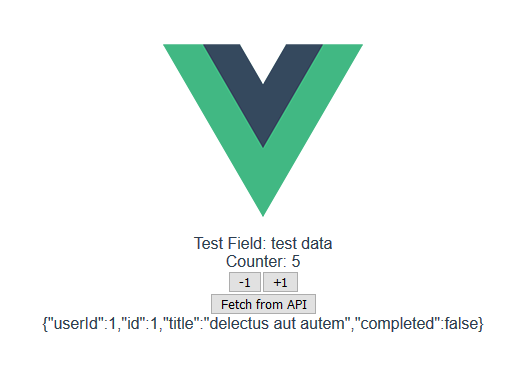

# Synopsis

Simple proof of concept with comparison of two ways to create Vuex store modules.
Both projects work exactly the same way and have same funcionality.
Names in the code are preserved where possible in both projects.

# Modules

- vuex-only: Reference project using JavaScript and regular Vuex modules
- vuex-modules: Reference project using TypeScript, Vue class components and Vuex dynamic class modules

# Run

> NOTE: `npm` can be used instead of `yarn`

1. Go to project directory (`vuex-modules` or `vuex-only`)
2. Install dependencies by `yarn install`
3. Run dev server by `yarn run serve`
4. Open browser at [localhost:8080](http://localhost:8080)